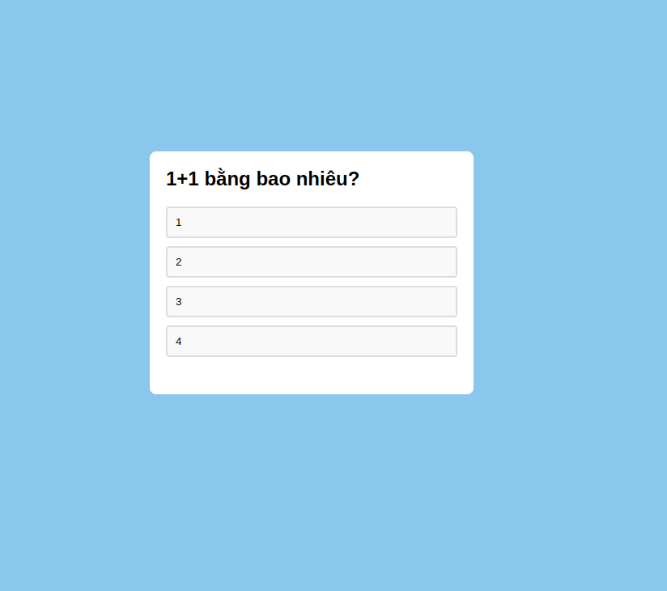

---

### **2. Quiz App (`README.md`)**

```markdown
# 📝 Quiz App | クイズアプリ



## Overview | 概要
This app allows users to take quizzes and automatically checks if the answers are correct or incorrect.  
ユーザーがクイズに挑戦できるアプリで、正解、不正解を自動的に判定します。

## ✨ Features | 機能
- ❓ Multiple choice questions | 選択式問題
- ✅ Automatic answer validation | 自動的に答えを判定
- 📊 Score tracking | スコア追跡

## 🛠 Installation | インストール方法
1. Clone the repository:  
   リポジトリをクローンします：
   ```bash
   git clone https://github.com/Vuinguyen08/quiz-app.git

